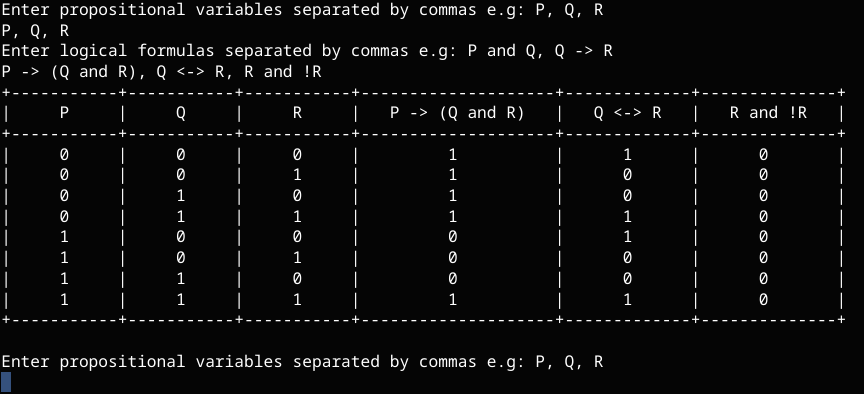

# PythonLogicTableGenerator
A logic table generator written for Python 3.x



## Instructions for use:
1. Have python3 on your system
2. Download logic.py file
3. Execute in terminal using command ```python3 logic.py``` (Potential bugs in IDLE; haven't tested)
4. List propositional variables to be used e.g P, Q, R
5. List formulas to be computed e.g P -> Q, Q and R

## Functioning operators:
- "->" monoconditional implication
- "<->" biconditional implication
- and, or, not
- xor, nand, nor

## How to end it
Press Ctrl+C and whatever it is for MacOS
